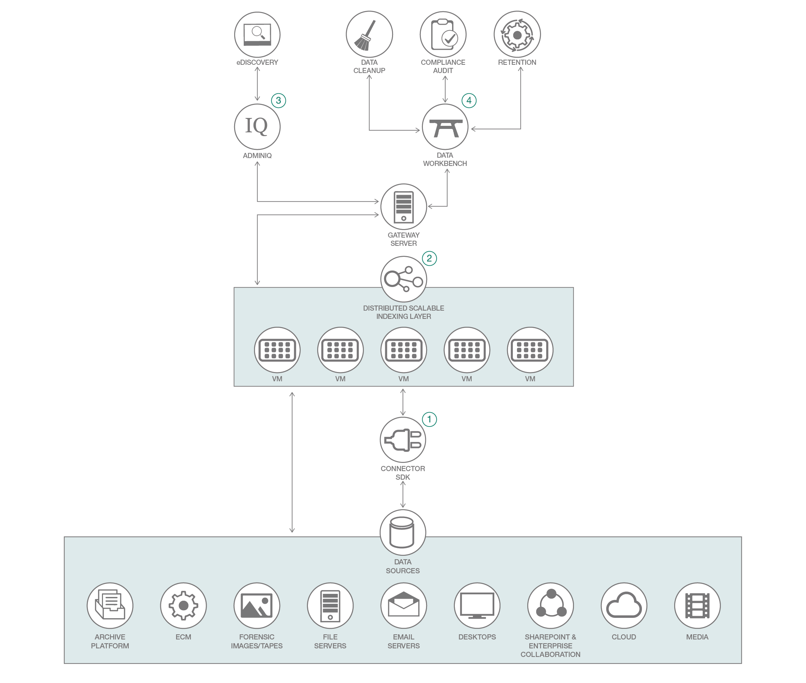
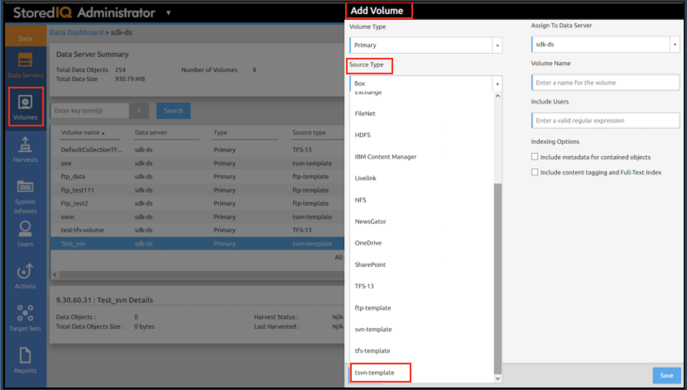
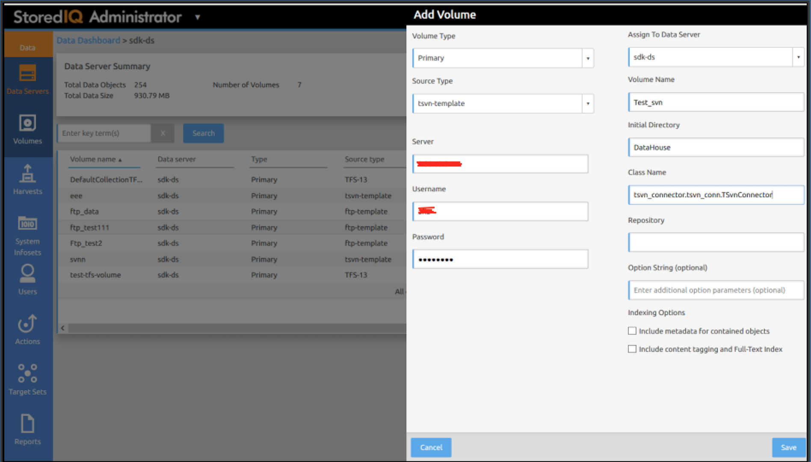
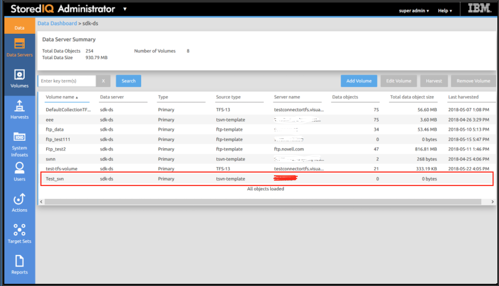
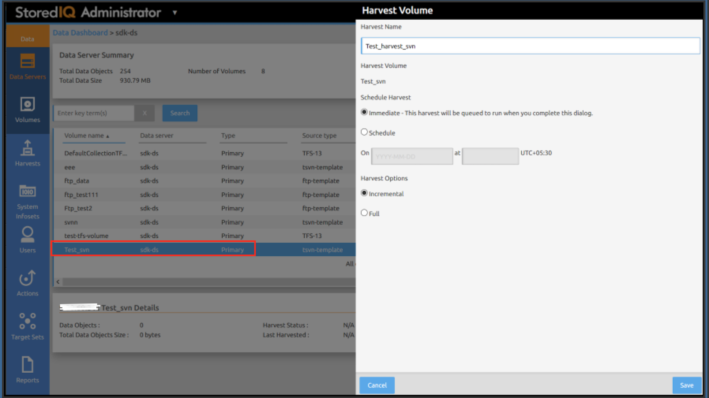
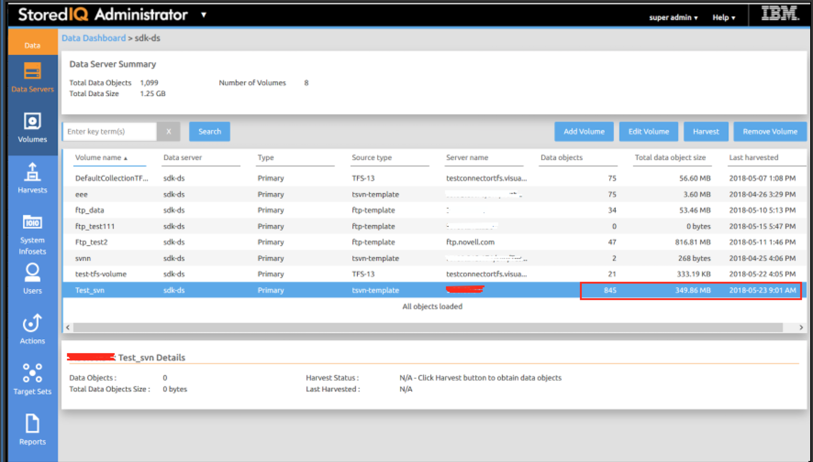
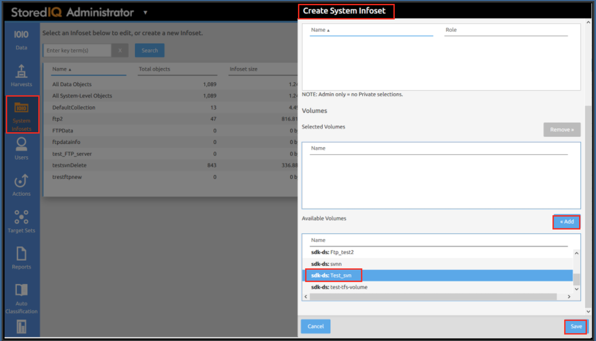
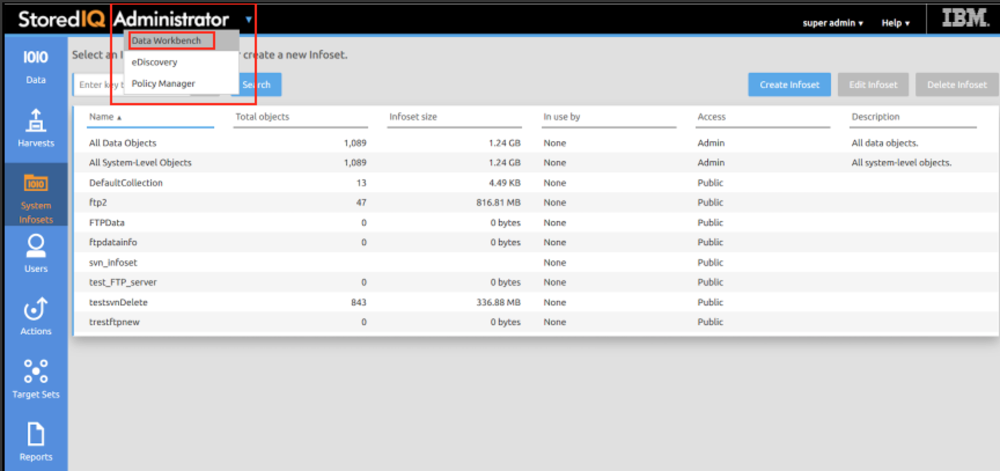
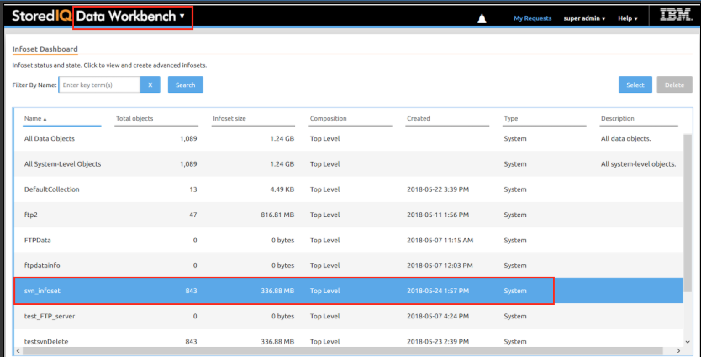
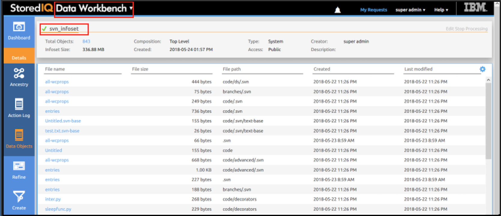

# Adding new data sources to IBM StoredIQ using Connector API SDK 

Data is growing exponentially. With this growth of data, organizations find it difficult to make business value out of this data effectively. This growth in data has also contributed to new challenges like security, governing and protecting privacy. IBM StoredIQ platform provides powerful solutions for managing unstructured data in-place. It addresses the problems of records management, electronic discovery, compliance, storage optimization, and data migration initiatives. 

Organizations have freedom to choose data sources for their need. It may involve multiple data sources with different versions. A data source can be considered as a location which contains unstructured content. By providing an in-depth assessment of unstructured data where it is, the StoredIQ gives organizations visibility into data to make more informed business and legal decisions. Data Source is an important part for IBM StoredIQ solution. StoredIQ provides flexibility to customers to choose data source and it supports 85+ data sources out of the box. Some of the data sources include Box, Microsoft Office 365, FileNet etc. All the features of IBM StoredIQ can be utilized by making a connection between a data source and StoredIQ. The connection between a data source and StoredIQ is established using a connector.  

IBM StoredIQ provides a Connector API SDK which can be used by business partners and customers to create custom connector for new data sources which StoredIQ does not support. The IBM StoredIQ Connecter API SDK simplifies connector development by decoupling connector logic from the StoredIQ application logic. It can also be used to customise and extend existing connector. Once you create a new connector, you can use it to manage data in StoredIQ just like you do it with the supported data sources.

This code pattern helps you to understand the methodology and the steps of building a connector of a new data source. In this pattern, we explain the different aspects of connector development with [code](source) for SVN server and FTP server. When the user has completed this code pattern, they will understand how to develop, integrate, register and test the connector for IBM StoredIQ.

## Flow

  
  
  1. Develop the connector for data source using Connector SDK.
  2. Integrate and Register the connector with StoredIQ Data Server and Gateway Server.
  3. Add volume for the new connector using Administrator Dashboard of StoredIQ, harvest it and create infoset.
  4. Content of the data source can be seen at Data Workbench dashboard.


## Included Components

* [IBM StoredIQ](https://www.ibm.com/support/knowledgecenter/en/SSSHEC_7.6.0/overview/overview.html): IBM StoredIQ Platform provides scalable analysis and governance of unstructured data in-place across disparate and distributed email, file shares, desktops, and collaboration sites.

* [SVN Server](https://docs.oracle.com/middleware/1212/core/MAVEN/config_svn.htm#MAVEN8824): Subversion is a version control system that keeps track of changes made to files and folders or directories, thus facilitating data recovery and providing a history of the changes that have been made over time.

* [FTP Server](https://en.wikipedia.org/wiki/File_Transfer_Protocol): An FTP server is a computer which has a file transfer protocol (FTP) address and is dedicated to receiving an FTP connection. The FTP is a standard network protocol used for the transfer of computer files between a client and server on a computer network.

## Featured Technologies

* [Python](https://www.python.org/): Python is a programming language that lets you work quickly and integrate systems more effectively.

* [IBM StoredIQ Connector API SDK](doc/IBM_StoredIQ_Connector_API_SDK.pdf): Using IBM StoredIQ Connector API SDK, developers can develop Connectors to new data sources outside IBM StoredIQ development environment. 

## Methodology

All operations that are run by IBM StoredIQ application on data objects are categorized as the following APIs:

* **Connection management**
 
  The APIs in this group manage connections to the data source.
  
* **Data object traversal management**

  APIs in this group manage data traversal. By default, StoredIQ traverses data source tree in depth-first pattern.
  
* **Attribute management**

  APIs in this group manage custom attributes. The standard attributes of a data object collected by Stored IQ by default includes size, access times etc.
  
* **Content access management**

  APIs in this group manage the content that is retrieved from the data objects like open file, read file and so on.

To develop a connector, need to implement these APIs.

## Pre-requisites

Set up the data source as per the requirement.

* [SVN Server](https://docs.oracle.com/middleware/1212/core/MAVEN/config_svn.htm#MAVEN8824): Setup SVN server.

* [FTP Server](https://www.wikihow.com/Set-up-an-FTP-Server-in-Ubuntu-Linux): Setup FTP server.

## Steps

Follow these steps to run this code pattern. 

1. [Develop the IBM StoredIQ Connector](#1-develop-the-ibm-storediq-connector)
2. [Integrate the Connector with live IBM StoredIQ](#2-integrate-the-connector-with-live-ibm-storediq)
3. [Register the Connector with live IBM StoredIQ](#3-register-the-connector-with-live-ibm-storediq)
4. [Test the Connector](#4-test-the-connector)

### 1. Develop the IBM StoredIQ Connector 

In this pattern, the connector is developed for `svn` and `ftp` data source. The code for svn data source is provided in  `svn_connector` and for ftp data source, the code is available at `ftp_connector` in the repository. To start with, clone the repository.

```
 git clone  https://github.com/IBM/connector-for-storediq.git
```

If you want to know the steps to develop the connector, read the details provided below. Otherwise move to [Step 2](#2-integrate-the-connector-with-live-ibm-storediq).

**Steps to develop the connector**

> Here examples, code-snippets and snapshots are shown for `svn connector`. The steps for `ftp connector` are the same. Please see the folder `ftp_connector` for details.

Connector API SDK shares the Python modules with the user that acts as a template for developing a new connector. These modules contain the default implementation and the utility functions. These shared modules come preinstalled in the `/usr/lib/python2.6/site-packages/siq_connector` folder. More details for these modules can be found [here](doc/IBM_StoredIQ_Connector_API_SDK.pdf).

The connector API SDK also includes code that implements a fully working NFS based sample connector. This sample connector is also preinstalled at `/usr/lib/python2.6/site-packages/sample_connector` folder. To make development of a new data source connector simpler, we have chosen this `sample_connector` as a base code. We will copy this folder as a new connector folder. In this pattern, we have given name as `svn_connector`.

```
$ cd /usr/lib/python2.6/site-packages
$ cp -r sample_connector svn_connector
```

Now `svn_connector` contains following python modules:

* **`__init__.py`**

  It is as per the python convention to treat the directory as a python package.
  
* **sdk_version.py**

  Avoid making changes to this. This module is provided for version compatibility enforcement.
  
* **sample_attributes.py**

  Change the name of the data source in `sample_attributes.py`. Here we are giving data source name as `tsvn-template`.
  
  

  > Note: fs_name could be anything.
  
* **sample_conn.py**

  Rename this file as `svn_conn.py`. The actual code for svn data source connector is written in the `svn_conn.py` module. The
  `svn_conn.py` will be containing APIs to connect and traverse through data sources. As mentioned in [Methodology](#methodology), need to add code for all four categories. 
  
  High level flow of code for svn connector can be explained as follows.
  
  * *connect()* uses the information provided by constructor method to establish connection with the server that hosts the data source. The constructor method provides information that is collected by using the `Add Volume` dialog as explained in [Test section](#4-test-the-connector).
  
  * *Create mount point*. It checks if the path for mount point exists, else it creates the path and bind that path for a local checkout.
  
  * *validate_directories()* creates a new directory (if does not exist) with the same name as of `Initial Directory` value given by user from StoredIQ dashboard as explained in [Test section](#4-test-the-connector). The checked-out content will be placed here.
  
  * *checkout* all the content from a specific repository of the data source to StoredIQ Data Server. To perform data operations with svn server `pysvn` package is used and `pysvn.Client.checkout()` is used to checkout from svn data source. After checkout, mount all these files to the mount point created earlier.
  
  * *list_dir()* lists the files and sub-directories in the specified repository. This method gets called when we harvest the newly added volume in StoredIQ. The firt time call of `list_dir()`, internally calls checkout function.
  
  * *lstat()* gets called if a directory is chosen to list the files. This method retrieves the file system-specific attributes like size, timestamp etc. for the specified file.
  
  > **Note:** This pattern provides you code only for read capability of svn and ftp connector. It can be extended further to add write and delete capability. 

### 2. Integrate the Connector with live IBM StoredIQ

To integrate the connector with live Stored IQ, need to copy the directory that contains the Connector code i.e. `svn_connector` directory in each Data Server and Gateway. The command to execute on your development system will be :

```
 # for Data server
 scp –rp svn_connector root@<IP address of Dataserver>:/usr/lib/python2.6/site-packages
 
 # for Gateway
 scp –rp svn_connector root@<IP address of Gateway>:/usr/lib/python2.6/site-packages
```
> **Note:** 
> 1. If development system is Windows, then copy operation can be done using `winscp`.
> 2. If you are performing the steps for ftp connector, need to copy `ftp_connector` directory in servers.

### 3. Register the Connector with live IBM StoredIQ

To register the connector, perform the following steps on each Data Server and Gateway.

1.	Change your directory to site-packages.
   
   ```
   cd /usr/lib/python2.6/site-packages
   ```
  
2. Run the following command.

   python32 /usr/loca/storediq/bin/register_connector.py -c < classpath > [-w ’yes’ | ’no’]
 
   For example, if your Connector folder is `my_connector`, class name is `MyConnector` and the module that defines the class is `my_module`, then class-path will be `my_connector.my_module.MyConnector` (quotes included).
   
   For the `-w` option, if it is specified, it indicates that the Connector is a read-write Connector.
   
   ```
   # For SVN data source connector
   python32 /usr/local/storediq/bin/register_connector.py -c svn_connector.svn_conn.SvnConnector
   
   # For FTP data source connector
   python32 /usr/local/storediq/bin/register_connector.py -c ftp_connector.ftp_conn.FtpConnector
   ```

   > Run the command `python32 /usr/loca/storediq/bin/register_connector.py -h` for more information.
   
3. Restart services on the Data Server and Gateway. Use the following command to restart.
  
   ```
   service deepfiler restart
   ```
   
   Before proceeding to next step, wait till both the servers come up.

### 4. Test the Connector

* Access the StoredIQ dashboard. If the connector is successfully integrated with StoredIQ, it will be visible as a new source type at StoredIQ dashboard.

> Here snapshots are shown for svn connector. Need to perform the similiar instructions for ftp connector.

  ```
  StoredIQ Administrator Dashboard > Volumes > Add Volume > Source Type
  ```
  
  

* Now we can select our connector `tsvn-template` as source type and fill other details in dashboard as shown.
  * Server name – It is domain name or IP address of svn server.
  * Username – It is required to authenticate user to remote svn server.
  * Password – It is password of svn server required to authenticate user to remote svn server.
  * Volume name – This will be the name of our newly added volume. It could be any name.
  * Initial Directory – It will be name of any directory where checked-out content will be placed.
  * Class name – This will be the class path name as discussed earlier.
  
  Click on `Save` to add this volume.
  
  
 
* Once the volume is added successfully, it will be available in list of volume in dashboard.

  

* Now harvest can be run on newly added volume to see the content of svn server in StoredIQ dashboard. To do that select the newly added volume `Test_svn` from the list of volumes and click on `Harvest`. Further it will ask for harvest name which could be anything and will give few options to select such as immediate or schedule harvest and full or incremental harvest as shown in image. Choose the appropriate option and click on `Save`.

  

* Once the harvest is completed, the details of newly added volume will get updated and will show number of data objects added and total data objects size.

  

* Now need to create Infoset to see the content of svn server in StoredIQ dashboard and to read the content of files. Go to 

  ```
  StoredIQ Administrator Dashboard > System Infosets > Create Infoset
  ```
  
  Give the required details and select newly added volumes from available volumes. Click `Add` and then `Save`.

  

* After creating the infoset, go to Data Workbench from the StoredIQ dashboard.

  

* Data Workbench will show list of infoset status and state. Select the infoset added in previous step from the list.

  

* Once infoset is selected, all the contents of your svn server would be visible and content of file can be seen by clicking file name.

  
  
Using this methodology, a connector can be built for any new data source with IBM StoredIQ.

## License
This code pattern is licensed under the Apache Software License, Version 2.  Separate third party code objects invoked within this code pattern are licensed by their respective providers pursuant to their own separate licenses. Contributions are subject to the [Developer Certificate of Origin, Version 1.1 (DCO)](https://developercertificate.org/) and the [Apache Software License, Version 2](http://www.apache.org/licenses/LICENSE-2.0.txt).

[Apache Software License (ASL) FAQ](http://www.apache.org/foundation/license-faq.html#WhatDoesItMEAN)
